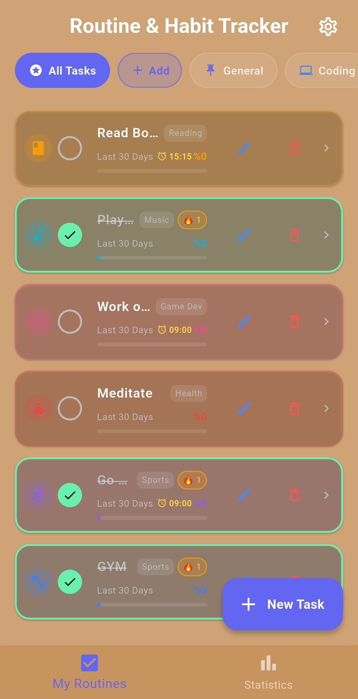
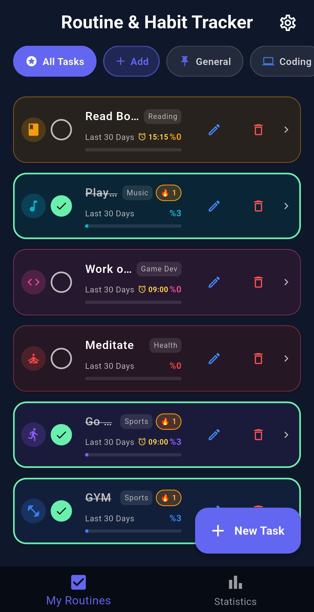
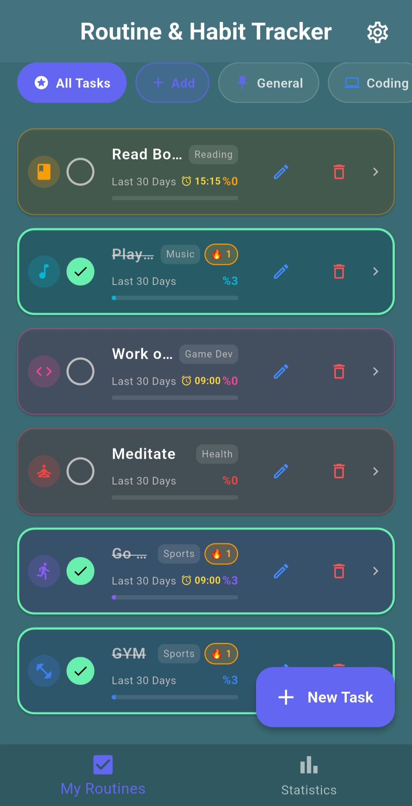
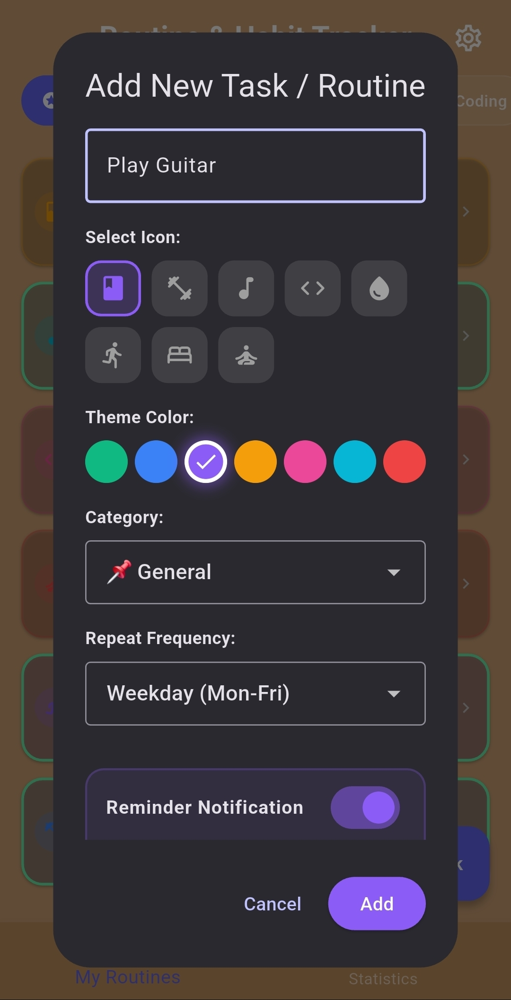
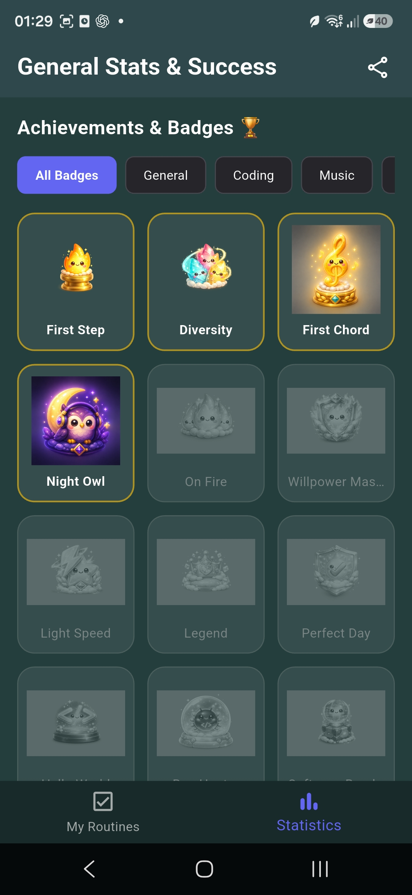
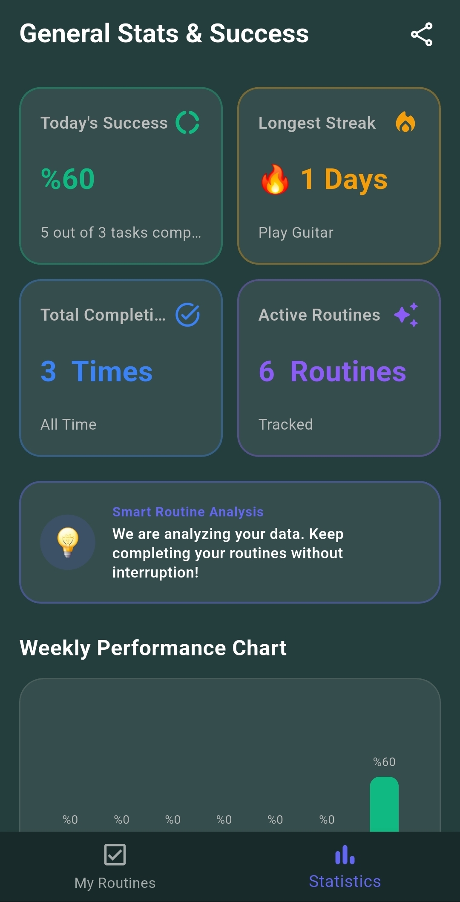
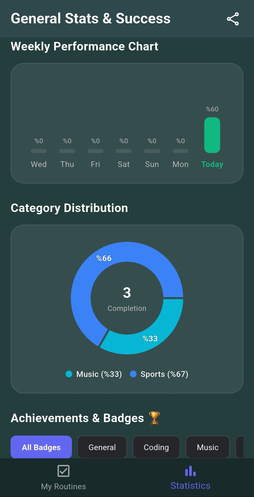
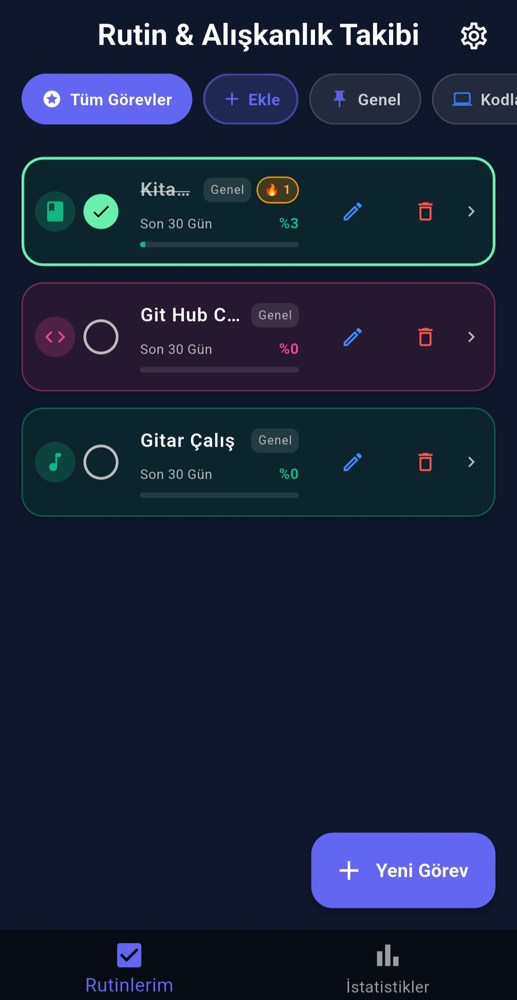
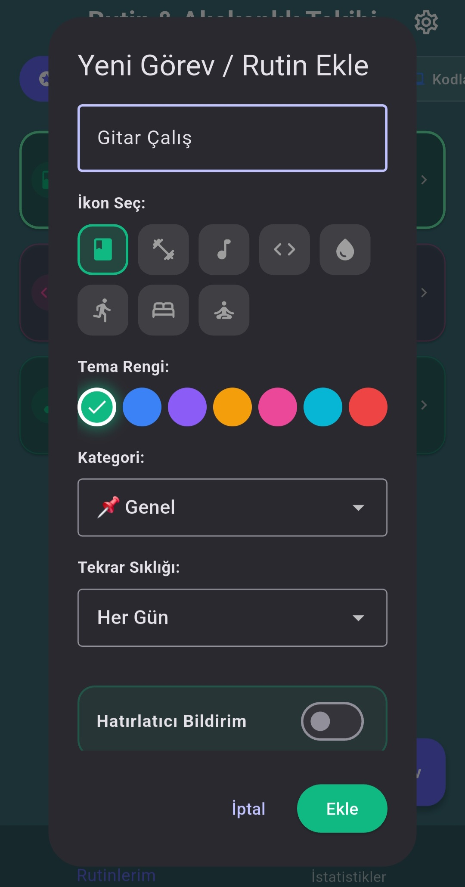
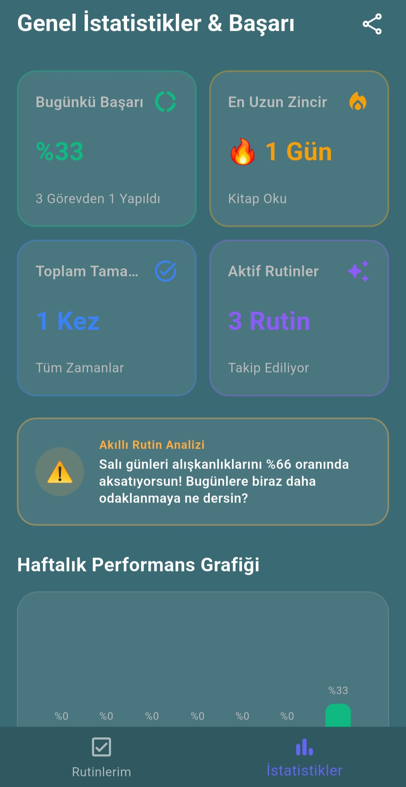

  

<h1 align="center">HABITTO</h1>

  <a href="#english">English</a> | <a href="#türkçe">Türkçe</a>

---

<h2 id="english">English</h2>

  <strong>Build routines. Keep your momentum. See your progress.</strong>

  A modern, customizable, and local-first habit tracker built with Flutter.

  
  
  
  

  

---

### What's New in v1.1.0 🚀
- **Multi-Language Support**: Habitto now speaks both English and Turkish!
- **Enhanced Badge System**: New achievements added with beautiful animated pop-ups when unlocked.
- **Reliable Notifications**: Timezone-aware local notifications for accurate reminders anywhere in the world.
- **Improved UI/UX**: Smarter insight cards and cleaner statistical visualizations.

---

### About

**Habitto** is a customizable habit and routine tracker designed to make consistency visible, motivating, and rewarding.

Users can create routines, organize them into categories, receive reminders, track streaks, review detailed statistics, unlock achievements, and back up their data without creating an account or depending on a remote server.

Habitto stores its data locally using Hive, providing a fast, offline-first, and privacy-focused experience.

### Demo

  

### Download

The latest Android version of Habitto is available through GitHub Releases.

  <a href="https://github.com/kagankurubas/habitto/releases/latest">
    <strong>Download the latest Habitto release for Android</strong>
  </a>

#### Android Installation

1. Open the latest release page.
2. Download the Habitto APK from the **Assets** section.
3. Open the downloaded APK on your Android device.
4. Allow installation from your browser or file manager if Android requests permission.
5. Install and open Habitto.
6. Grant notification permission to receive habit reminders.

> Habitto is currently distributed directly through GitHub and is not yet available on Google Play.

### Application Preview

#### Personalized Home Experience

  Habitto offers multiple visual themes while preserving a clean,
  focused, and consistent habit-tracking experience.

<table align="center">
  <tr>
    <td align="center">
      
       
      <strong>Theme Preview I</strong>
    </td>
    <td align="center">
      
       
      <strong>Theme Preview II</strong>
    </td>
    <td align="center">
      
       
      <strong>Theme Preview III</strong>
    </td>
  </tr>
</table>

#### Habit Management and Progress

<table align="center">
  <tr>
    <td align="center">
      
       
      <strong>Create Habits</strong>
    </td>
    <td align="center">
      
       
      <strong>Unlock Achievements</strong>
    </td>
  </tr>
</table>

#### Statistics and Insights

  Track your progress over time with detailed charts and intelligent performance metrics.

<table align="center">
  <tr>
    <td align="center">
      
       
      <strong>Performance Dashboard</strong>
    </td>
    <td align="center">
      
       
      <strong>Weekly Insights</strong>
    </td>
  </tr>
</table>

### Features

#### Habit Management

- Create, edit, complete, and delete habits
- Assign custom colors and icons
- Organize habits using customizable categories
- Filter the home screen by category
- View recent completion progress directly from the habit list
- Track daily targets and completed routines

#### Flexible Scheduling

Habitto supports multiple routine frequencies:

- Every day
- Weekdays
- Weekends
- Every `X` days
- Selected days of the week

#### Progress Tracking

- Current habit streaks
- Total completed days
- 30-day completion rate
- Calendar-based completion history
- GitHub-style activity heatmap
- Daily target and completion indicators

#### Statistics and Insights

- Overall performance metrics
- Weekly performance chart
- Category distribution
- Best and weakest day insights
- Shareable progress cards
- Achievement and badge system

#### Reminders

- Configurable local notifications
- Custom reminder times for individual habits
- Motivational notification messages
- Notification navigation directly to the related habit
- Notifications while the application is open, in the background, or closed

#### Personalization

- Multiple application themes
- Habit-specific colors
- Custom category colors and icons
- Optional completion sound
- Optional haptic feedback
- **Bilingual Interface** (English and Turkish)

#### Backup and Restore

- Export habit and category data as JSON
- Restore data from a previous JSON backup
- Cross-platform file handling
- No account or cloud service required

### Tech Stack

| Technology | Purpose |
| --- | --- |
| Flutter | Cross-platform user interface development |
| Dart | Application language |
| Hive | Fast local data storage |
| Table Calendar | Calendar-based habit history |
| Flutter Heatmap Calendar | Activity heatmap |
| FL Chart | Statistics and performance charts |
| Flutter Local Notifications | Scheduled habit reminders |
| Timezone | Timezone-aware notification scheduling |
| Share Plus | Backup and statistics sharing |
| File Picker | JSON backup file selection |
| AudioPlayers | Completion sound effects |
| Path Provider | Platform-specific storage paths |
| Easy Localization | Multi-language translation support |
| GitHub Actions | Automated analysis, testing, and build validation |

### Roadmap

- [x] Add application screenshots
- [x] Add application demo GIF
- [x] Add initial unit tests
- [ ] Expand unit and widget test coverage
- [x] Add GitHub Actions for analysis, tests, and build validation
- [x] Publish downloadable Android releases
- [x] Add additional language support (Turkish added in v1.1.0)
- [ ] Improve accessibility support
- [ ] Explore optional encrypted backup support

---
<h2 id="türkçe">Türkçe</h2>

  <strong>Alışkanlıklar inşa et. İvmeyi koru. Gelişimini gör.</strong>

  Flutter ile geliştirilmiş, modern, özelleştirilebilir ve yerel veritabanı odaklı bir alışkanlık takip uygulaması.

  
  
  
  

  

---

### v1.1.0 ile Gelen Yenilikler 🚀
- **Çoklu Dil Desteği**: Habitto artık hem İngilizce hem de Türkçe konuşuyor!
- **Gelişmiş Rozet Sistemi**: Yeni başarımlar eklendi ve başarılar kilitlendiğinde açılan harika animasyonlu ekranlar tasarlandı.
- **Güvenilir Bildirimler**: Dünyanın neresinde olursanız olun hatırlatıcıların tam zamanında çalışması için saat dilimine duyarlı bildirim altyapısı kuruldu.
- **Geliştirilmiş Arayüz (UI/UX)**: Daha akıllı öngörü kartları (insight cards) ve temiz istatistik görünümleri.

---

### Hakkında

**Habitto**, istikrarı görünür, motive edici ve ödüllendirici hale getirmek için tasarlanmış, özelleştirilebilir bir alışkanlık ve rutin takip uygulamasıdır.

Kullanıcılar yeni rutinler oluşturabilir, bunları kategorilere ayırabilir, hatırlatıcılar alabilir, serilerini (streak) takip edebilir, detaylı istatistikleri inceleyebilir, başarımlar (rozetler) kazanabilir ve tüm verilerini bir hesap oluşturmadan veya uzak sunucuya bağlı kalmadan yedekleyebilir.

Habitto verilerini yerel olarak Hive kullanarak saklar; hızlı, çevrimdışı öncelikli (offline-first) ve gizlilik odaklı bir deneyim sunar.

### Demo

  

### İndirme Bağlantısı

Habitto'nun en güncel Android sürümü GitHub Releases üzerinden edinilebilir.

  <a href="https://github.com/kagankurubas/habitto/releases/latest">
    <strong>Android için son Habitto sürümünü indir</strong>
  </a>

#### Android Kurulumu

1. En güncel yayın (release) sayfasına gidin.
2. **Assets** bölümünden Habitto APK dosyasını indirin.
3. İndirilen APK'yı Android cihazınızda açın.
4. Android izin isterse tarayıcınızdan veya dosya yöneticisinden kuruluma izin verin.
5. Habitto'yu yükleyin ve açın.
6. Alışkanlık hatırlatıcılarını alabilmek için bildirim izni verin.

> Habitto şu anda doğrudan GitHub üzerinden dağıtılmaktadır ve henüz Google Play'de bulunmamaktadır.

### Uygulama Önizlemesi

#### Kişiselleştirilmiş Ana Sayfa Deneyimi

  Habitto, temiz, odaklı ve tutarlı bir alışkanlık takip deneyimi sunarken birden fazla görsel tema seçeneği de barındırır.

<table align="center">
  <tr>
    <td align="center">
      
       
      <strong>Tema Önizleme I</strong>
    </td>
    <td align="center">
      
       
      <strong>Tema Önizleme II</strong>
    </td>
    <td align="center">
      
       
      <strong>Tema Önizleme III</strong>
    </td>
  </tr>
</table>

#### Alışkanlık Yönetimi ve İlerleme

<table align="center">
  <tr>
    <td align="center">
      
       
      <strong>Alışkanlık Oluştur</strong>
    </td>
    <td align="center">
      
       
      <strong>Gelişimi Takip Et</strong>
    </td>
    <td align="center">
      
       
      <strong>Başarımların Kilidini Aç</strong>
    </td>
  </tr>
</table>

#### Tema Özelleştirme

  

  Alışkanlıkları anlaşılır ve yönetilebilir tutarken, uygulamayı kişiselleştirmek için birden fazla görsel tema ve görünüm seçeneği arasından seçim yapın.

### Özellikler

#### Alışkanlık Yönetimi

- Alışkanlık oluşturma, düzenleme, tamamlama ve silme
- Özel renkler ve ikonlar atama
- Özelleştirilebilir kategorilerle alışkanlıkları düzenleme
- Ana ekranı kategorilere göre filtreleme
- Alışkanlık listesinden son tamamlanma geçmişini anında görebilme
- Günlük hedefleri ve tamamlanan rutinleri takip etme

#### Esnek Zamanlama

Habitto farklı rutin sıklıklarını destekler:

- Her gün
- Hafta içi
- Hafta sonu
- Her `X` günde bir
- Haftanın seçili günleri

#### Gelişim Takibi

- Mevcut alışkanlık serileri (streak)
- Toplam tamamlanma sayısı
- 30 günlük tamamlanma oranı
- Takvim tabanlı tamamlanma geçmişi
- GitHub tarzı aktivite ısı haritası
- Günlük hedef ve tamamlanma göstergeleri

#### İstatistikler ve Öngörüler

- Genel performans metrikleri
- Haftalık performans grafiği
- Kategori dağılımı
- En iyi ve en zayıf gün analizleri
- Paylaşılabilir ilerleme kartları
- Başarım ve rozet sistemi

#### Hatırlatıcılar

- Yapılandırılabilir yerel bildirimler
- Her alışkanlık için özel hatırlatıcı saatleri
- Motive edici bildirim mesajları
- Bildirime tıklandığında doğrudan ilgili alışkanlığa gitme
- Uygulama açıkken, arka plandayken veya kapalıyken bildirim alma

#### Kişiselleştirme

- Birden çok uygulama teması
- Alışkanlığa özel renkler
- Özel kategori renkleri ve ikonları
- İsteğe bağlı tamamlama sesi
- İsteğe bağlı titreşim geribildirimi
- **Çift Dil Arayüzü** (İngilizce ve Türkçe)

#### Yedekleme ve Geri Yükleme

- Alışkanlık ve kategori verilerini JSON olarak dışa aktarma
- Önceki bir JSON yedeğinden verileri geri yükleme
- Çapraz platform dosya yönetimi
- Hesap veya bulut servisi gerektirmez

### Teknoloji Yığını

| Teknoloji | Kullanım Amacı |
| --- | --- |
| Flutter | Çapraz platform kullanıcı arayüzü geliştirme |
| Dart | Uygulama dili |
| Hive | Hızlı yerel veri depolama |
| Table Calendar | Takvim tabanlı alışkanlık geçmişi |
| Flutter Heatmap Calendar | Aktivite ısı haritası |
| FL Chart | İstatistikler ve performans grafikleri |
| Flutter Local Notifications | Zamanlanmış alışkanlık hatırlatıcıları |
| Timezone | Saat dilimine duyarlı bildirim planlama |
| Share Plus | Yedekleme ve istatistik paylaşımı |
| File Picker | JSON yedek dosya seçimi |
| AudioPlayers | Tamamlama ses efektleri |
| Path Provider | Platforma özel depolama yolları |
| Easy Localization | Çoklu dil çeviri desteği |
| GitHub Actions | Otomatik analiz, test ve derleme onayı |

### Yol Haritası

- [x] Uygulama ekran görüntülerini ekle
- [x] Uygulama demo GIF'ini ekle
- [x] Temel birim (unit) testlerini ekle
- [ ] Birim ve bileşen (widget) test kapsamını genişlet
- [x] Analiz, testler ve yapı onayı için GitHub Actions ekle
- [x] İndirilebilir Android sürümleri yayınla
- [x] Ek dil desteği ekle (v1.1.0 ile Türkçe eklendi)
- [ ] Erişilebilirlik (accessibility) desteğini geliştir
- [ ] İsteğe bağlı şifrelenmiş yedekleme desteğini araştır

---

## License / Lisans

This project is licensed under the [MIT License](LICENSE).

## Author / Geliştirici

Developed by **Nuri Kağan Kurubaş**.

  
  

---

  Built with Flutter and a focus on consistency, privacy, and measurable progress.  
  <i>Tutarlılık, gizlilik ve ölçülebilir ilerleme odaklı Flutter ile geliştirildi.</i>

