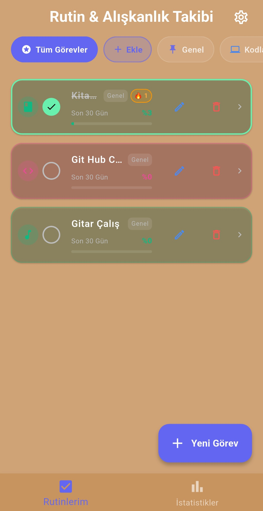
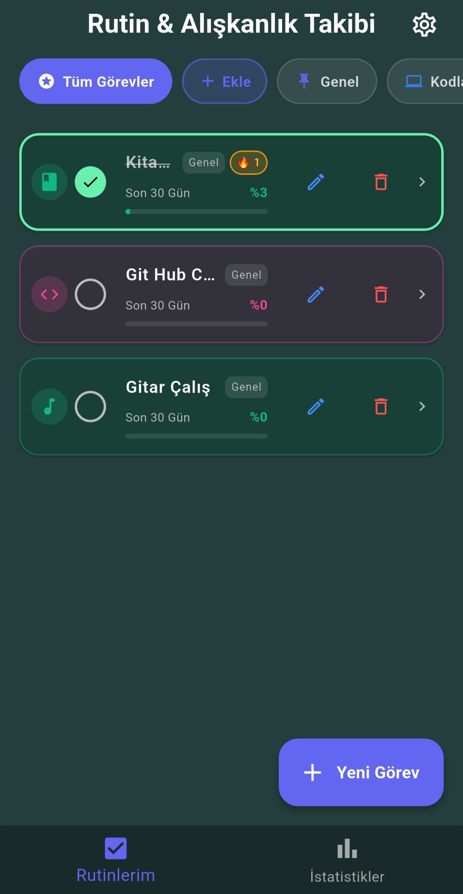
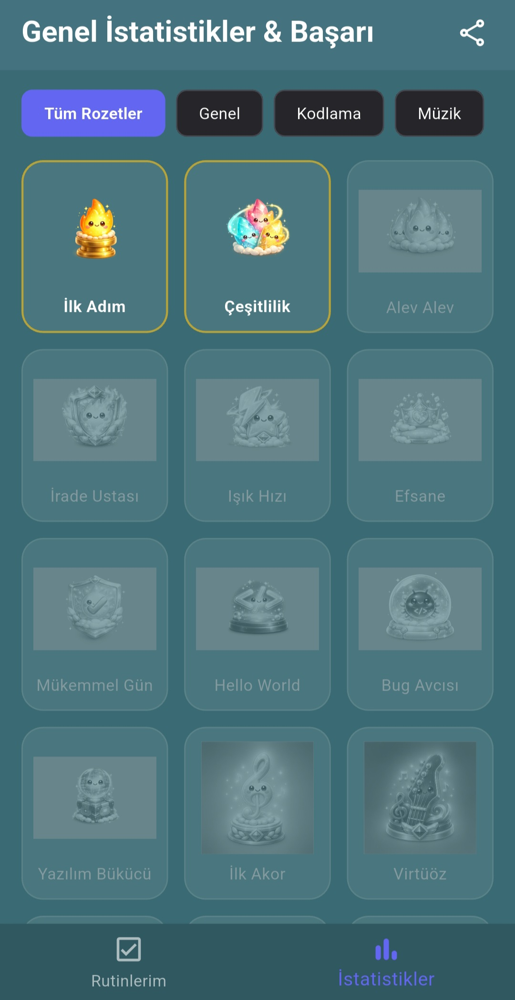
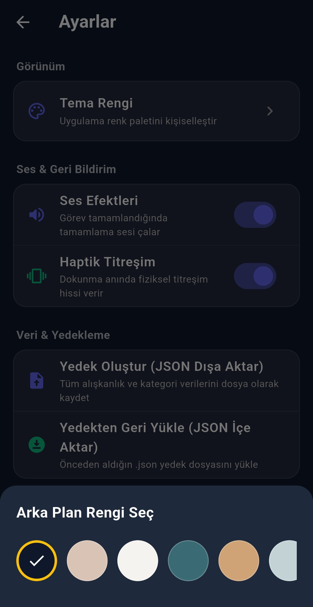

<p align="center">
  
</p>

<h1 align="center">HABITTO</h1>

<p align="center">
  <strong>Build routines. Keep your momentum. See your progress.</strong>
</p>

<p align="center">
  A modern, customizable, and local-first habit tracker built with Flutter.
</p>

<p align="center">
  
  
  <a href="https://github.com/kagankurubas/habitto/actions/workflows/flutter-ci.yml">
    
  </a>
  <a href="https://github.com/kagankurubas/habitto/releases/latest">
    
  </a>
</p>

<p align="center">
  <a href="https://github.com/kagankurubas/habitto/releases/latest">
    
  </a>
</p>

---

## About

**Habitto** is a customizable habit and routine tracker designed to make consistency visible, motivating, and rewarding.

Users can create routines, organize them into categories, receive reminders, track streaks, review detailed statistics, unlock achievements, and back up their data without creating an account or depending on a remote server.

Habitto stores its data locally using Hive, providing a fast, offline-first, and privacy-focused experience.

## Demo

<p align="center">
  
</p>

## Download

The latest Android version of Habitto is available through GitHub Releases.

<p align="center">
  <a href="https://github.com/kagankurubas/habitto/releases/latest">
    <strong>Download the latest Habitto release for Android</strong>
  </a>
</p>

### Android Installation

1. Open the latest release page.
2. Download the Habitto APK from the **Assets** section.
3. Open the downloaded APK on your Android device.
4. Allow installation from your browser or file manager if Android requests permission.
5. Install and open Habitto.
6. Grant notification permission to receive habit reminders.

> Habitto is currently distributed directly through GitHub and is not yet available on Google Play.

## Application Preview

### Personalized Home Experience

<p align="center">
  Habitto offers multiple visual themes while preserving a clean,
  focused, and consistent habit-tracking experience.
</p>

<table align="center">
  <tr>
    <td align="center">
      
      <br>
      <strong>Theme Preview I</strong>
    </td>
    <td align="center">
      
      <br>
      <strong>Theme Preview II</strong>
    </td>
    <td align="center">
      
      <br>
      <strong>Theme Preview III</strong>
    </td>
  </tr>
</table>

### Habit Management and Progress

<table align="center">
  <tr>
    <td align="center">
      
      <br>
      <strong>Create Habits</strong>
    </td>
    <td align="center">
      
      <br>
      <strong>Track Progress</strong>
    </td>
    <td align="center">
      
      <br>
      <strong>Unlock Achievements</strong>
    </td>
  </tr>
</table>

### Theme Customization

<p align="center">
  
</p>

<p align="center">
  Choose from multiple visual themes and appearance options to personalize
  the application while keeping habits clear and easy to manage.
</p>

## Features

### Habit Management

- Create, edit, complete, and delete habits
- Assign custom colors and icons
- Organize habits using customizable categories
- Filter the home screen by category
- View recent completion progress directly from the habit list
- Track daily targets and completed routines

### Flexible Scheduling

Habitto supports multiple routine frequencies:

- Every day
- Weekdays
- Weekends
- Every `X` days
- Selected days of the week

### Progress Tracking

- Current habit streaks
- Total completed days
- 30-day completion rate
- Calendar-based completion history
- GitHub-style activity heatmap
- Daily target and completion indicators

### Statistics and Insights

- Overall performance metrics
- Weekly performance chart
- Category distribution
- Best and weakest day insights
- Shareable progress cards
- Achievement and badge system

### Reminders

- Configurable local notifications
- Custom reminder times for individual habits
- Motivational notification messages
- Notification navigation directly to the related habit
- Notifications while the application is open, in the background, or closed

### Personalization

- Multiple application themes
- Habit-specific colors
- Custom category colors and icons
- Optional completion sound
- Optional haptic feedback

### Backup and Restore

- Export habit and category data as JSON
- Restore data from a previous JSON backup
- Cross-platform file handling
- No account or cloud service required

## Tech Stack

| Technology | Purpose |
| --- | --- |
| Flutter | Cross-platform user interface development |
| Dart | Application language |
| Hive | Fast local data storage |
| Table Calendar | Calendar-based habit history |
| Flutter Heatmap Calendar | Activity heatmap |
| FL Chart | Statistics and performance charts |
| Flutter Local Notifications | Scheduled habit reminders |
| Timezone | Timezone-aware notification scheduling |
| Share Plus | Backup and statistics sharing |
| File Picker | JSON backup file selection |
| AudioPlayers | Completion sound effects |
| Path Provider | Platform-specific storage paths |
| GitHub Actions | Automated analysis, testing, and build validation |

## Project Structure

```text
lib/
├── models/
│   ├── habit.dart
│   ├── category_model.dart
│   └── badge_model.dart
│
├── screens/
│   ├── home_screen.dart
│   ├── habit_detail_screen.dart
│   ├── stats_screen.dart
│   └── settings_screen.dart
│
├── services/
│   ├── backup_service.dart
│   ├── motivation_service.dart
│   ├── notification_service.dart
│   ├── share_service.dart
│   ├── stats_service.dart
│   └── theme_service.dart
│
├── widgets/
│   ├── stats/
│   ├── add_edit_habit_dialog.dart
│   ├── category_filter_bar.dart
│   ├── habit_tile.dart
│   └── badge_unlocked_dialog.dart
│
├── app_themes.dart
└── main.dart
```

## Getting Started

### Requirements

Before running the project, make sure the following tools are installed:

- Flutter SDK
- Dart SDK included with Flutter
- Android Studio, Visual Studio Code, or another Flutter-compatible IDE
- An Android emulator or physical Android device

### Installation

Clone the repository:

```bash
git clone https://github.com/kagankurubas/habitto.git
cd habitto
```

Install the dependencies:

```bash
flutter pub get
```

Run the application:

```bash
flutter run
```

### Select a Target Device

List available devices:

```bash
flutter devices
```

Run the application on a specific device:

```bash
flutter run -d <device-id>
```

Example:

```bash
flutter run -d android
```

## Code Generation

Habitto uses generated Hive adapters.

When a Hive model is changed, regenerate the adapter files with:

```bash
dart run build_runner build --delete-conflicting-outputs
```

Generated adapter files are already included in the repository, so this command is not required for a normal installation.

## Building

### Android APK

```bash
flutter build apk --release
```

The generated APK can be found under:

```text
build/app/outputs/flutter-apk/app-release.apk
```

### Android App Bundle

```bash
flutter build appbundle --release
```

Platform-specific features such as notifications, sharing, file selection, and local storage may behave differently depending on the target platform.

## Continuous Integration

Habitto uses GitHub Actions to validate every push and pull request targeting the `main` branch.

The workflow automatically performs the following checks:

```bash
dart format --output=none --set-exit-if-changed lib test
flutter analyze
flutter test
flutter build apk --debug
```

A green CI status indicates that:

- Source code formatting is valid
- Flutter analysis completes without issues
- Automated tests pass
- The Android debug application builds successfully

The workflow can also be started manually through the GitHub Actions page.

## Testing

Run all automated tests:

```bash
flutter test
```

Run a specific test file:

```bash
flutter test test/habit_test.dart
```

Current automated tests cover the initial habit model behavior. Additional unit and widget test coverage is planned.

## Data and Privacy

Habitto is designed as a local-first application.

- Habit data is stored locally using Hive
- No user account is required
- No analytics or tracking service is included
- No personal habit data is uploaded automatically
- Users can manually export their data as a JSON backup
- The application can be used without a permanent internet connection

Deleting the application or clearing its local storage may remove existing data unless a backup has been created.

## Roadmap

- [x] Add application screenshots
- [x] Add application demo GIF
- [x] Add initial unit tests
- [ ] Expand unit and widget test coverage
- [x] Add GitHub Actions for analysis, tests, and build validation
- [x] Publish downloadable Android releases
- [ ] Add additional language support
- [ ] Improve accessibility support
- [ ] Explore optional encrypted backup support

## Contributing

Contributions, bug reports, and feature suggestions are welcome.

1. Fork the repository.

2. Create a new branch:

```bash
git checkout -b feature/my-feature
```

3. Make your changes.

4. Format and validate the project:

```bash
dart format lib test
flutter analyze
flutter test
```

5. Commit your changes:

```bash
git commit -m "Add my feature"
```

6. Push the branch:

```bash
git push origin feature/my-feature
```

7. Open a pull request.

Please keep pull requests focused and make sure the GitHub Actions workflow passes before requesting a review.

## License

This project is licensed under the [MIT License](LICENSE).

## Author

Developed by **Nuri Kağan Kurubaş**.

<p>
  <a href="https://github.com/kagankurubas">
    
  </a>
  <a href="https://kagankurubas.github.io">
    
  </a>
</p>

---

<p align="center">
  Built with Flutter and a focus on consistency, privacy, and measurable progress.
</p>